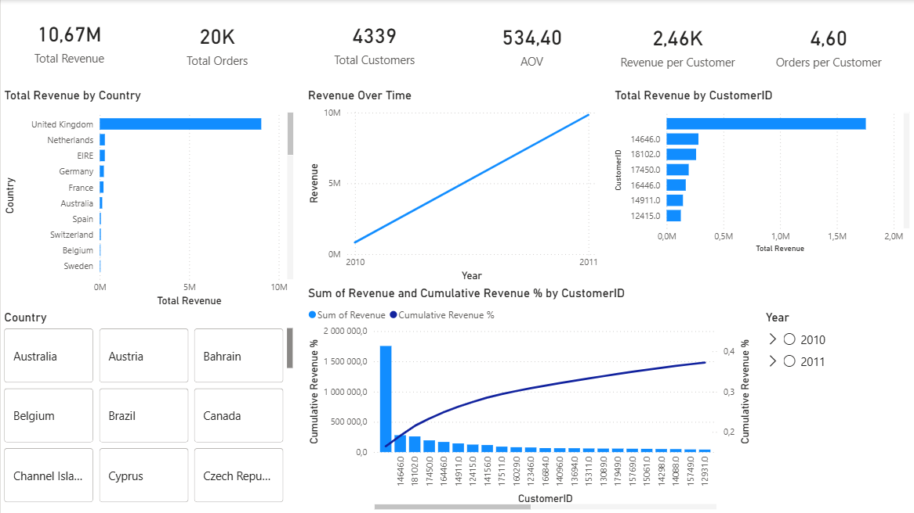

# Business Performance Analytics

## Project Overview
This project focuses on analyzing transactional data from an online retail company to assess business performance, customer concentration, and revenue dynamics over time.

The objective of the project is to demonstrate an end-to-end analytics workflow:  
from raw transactional data → data cleaning → KPI calculation → business insights → interactive dashboards.

## Data Source

The clean dataset is not included in the repository due to file size limitations.
the clean and raw datasets are available here:
https://drive.google.com/drive/folders/1-OxCxu3kUkfWN-SOgmVQpraj2LWJzxjQ?usp=drive_link

Place the file into `data/raw/` before running the notebook.

Source:
- Online Retail Dataset (UCI Machine Learning Repository)
  https://archive.ics.uci.edu/ml/datasets/online+retail

## Dataset
- **Source:** Online Retail transactional dataset  
- **Time period:** December 2010 – December 2011  
- **Size:** ~540,000 transaction rows  
- **Granularity:** Line-item transactional data  

Due to file size limitations, raw and processed datasets are not stored in this repository.  
All analysis steps are fully reproducible using the provided notebook.

## Tools & Technologies
- **Python:** pandas, matplotlib  
- **SQL:** SQLite (KPI validation and aggregations)  
- **Power BI:** interactive dashboards, DAX measures, slicers  
- **GitHub:** project structuring and version control  

## Analysis Scope
The analysis covers:
- Data quality checks (cancellations, zero or negative values, missing customer IDs)
- Transaction- and order-level aggregation
- Revenue-based KPIs and business metrics
- Customer concentration and Pareto (80/20) analysis
- Time-based revenue trends (monthly and yearly)
- Cross-validation of results using SQL queries

## Key Metrics
- **Total Revenue**
- **Total Orders**
- **Total Customers**
- **Average Order Value (AOV)**
- **Revenue per Customer**
- **Orders per Customer**

## Key Insights
- Revenue is highly concentrated: a small group of customers accounts for a large share of total revenue.
- Clear seasonality is observed, with revenue peaking toward the end of the year.
- A significant number of transactions lack customer identifiers, limiting customer-level analysis but not affecting aggregate KPIs.
- Business performance is driven primarily by repeat high-value customers rather than a uniformly distributed customer base.

## Power BI Dashboard
An interactive Power BI dashboard was developed to visualize key business insights, including:
- Total revenue by country
- Revenue trends over time
- Top customers by revenue
- Cumulative revenue share (Pareto curve)
- KPI summary cards with interactive filters (country, year, quarter)

The interactive Power BI dashboard is available in this repository:

`/powerbi/business_dashboard.pbix`

Due to GitHub limitations, the file cannot be previewed online.
To view the dashboard, please download the `.pbix` file and open it in Power BI Desktop.

### Dashboard Preview

 ## The notebook includes:
- Data cleaning logic
- Feature engineering
- KPI computation
- Exploratory analysis
- SQL-based validation of metrics

## Author
**Konstantin Rudnev**  
Aspiring Data Analyst / Business Analyst  
Open to opportunities across Europe

🔗 GitHub: https://github.com/Konstantin667
