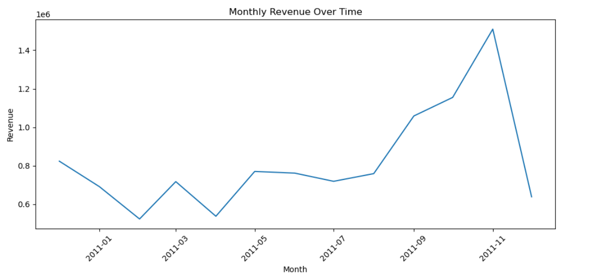

# Business Performance Analytics

## Project Overview
This project focuses on analyzing transactional data from an online retail company to assess business performance, customer concentration, and revenue dynamics over time.

The objective of the project is to demonstrate an end-to-end analytics workflow:  
from raw transactional data → data cleaning → KPI calculation → business insights → interactive dashboards.

## Data Source

The clean dataset is not included in the repository due to file size limitations.
the clean and raw datasets are available here:
https://drive.google.com/drive/folders/1-OxCxu3kUkfWN-SOgmVQpraj2LWJzxjQ?usp=drive_link

Place the file into `data/raw/` before running the notebook.

Source:
- Online Retail Dataset (UCI Machine Learning Repository)
  https://archive.ics.uci.edu/ml/datasets/online+retail

## Dataset
- **Source:** Online Retail transactional dataset  
- **Time period:** December 2010 – December 2011  
- **Size:** ~540,000 transaction rows  
- **Granularity:** Line-item transactional data  

Due to file size limitations, raw and processed datasets are not stored in this repository.  
All analysis steps are fully reproducible using the provided notebook.

## Tools & Technologies
- **Python:** pandas, matplotlib  
- **SQL:** SQLite (KPI validation and aggregations)  
- **Power BI:** interactive dashboards, DAX measures, slicers  
- **GitHub:** project structuring and version control  

## Analysis Scope
The analysis covers:
- Data quality checks (cancellations, zero or negative values, missing customer IDs)
- Transaction- and order-level aggregation
- Revenue-based KPIs and business metrics
- Customer concentration and Pareto (80/20) analysis
- Time-based revenue trends (monthly and yearly)
- Cross-validation of results using SQL queries

## Key Metrics
- **Total Revenue**
- **Total Orders**
- **Total Customers**
- **Average Order Value (AOV)**
- **Revenue per Customer**
- **Orders per Customer**

## Key Insights
- **Strong revenue concentration**  
  A small proportion of customers generates a dominant share of total revenue, confirming a pronounced Pareto (80/20) pattern in customer value distribution.

- **Highly skewed transaction values**  
  Most orders are low-value, while a limited number of high-revenue transactions significantly influence total sales.  
  This makes mean-based KPIs sensitive to outliers and emphasizes the importance of distribution-aware analysis.

- **Clear seasonal revenue dynamics**  
  Revenue exhibits a strong upward trend toward the end of the year, indicating seasonality likely driven by holidays and peak retail demand periods.

- **Repeat customers as primary revenue drivers**  
  Business performance depends more on a small base of repeat, high-value customers than on broad, uniform purchasing behavior across the customer base.

- **Data limitations with minimal KPI impact**  
  Missing customer identifiers reduce granularity of customer-level analysis but do not materially distort aggregate revenue KPIs or overall business conclusions.

## Power BI Dashboard
An interactive Power BI dashboard was developed to visualize key business insights, including:
- Total revenue by country
- Revenue trends over time
- Top customers by revenue
- Cumulative revenue share (Pareto curve)
- KPI summary cards with interactive filters (country, year, quarter)

The interactive Power BI dashboard is available in this repository:

`/powerbi/business_dashboard.pbix`

Due to GitHub limitations, the file cannot be previewed online.
To view the dashboard, please download the `.pbix` file and open it in Power BI Desktop.

### Dashboard Preview

### Customer Revenue Concentration (Pareto Analysis)

This chart illustrates cumulative revenue contribution by customers sorted by revenue.  
Approximately 80% of total revenue is generated by a relatively small subset of customers, highlighting strong revenue concentration.

### Distribution of Order Revenue

The revenue distribution is heavily right-skewed, indicating that most orders are low-value while a small number of transactions contribute disproportionately to total revenue.

### Monthly Revenue Over Time

Monthly revenue trends reveal clear seasonality, with noticeable growth toward the end of the year.  
This pattern aligns with typical retail demand cycles and supports season-aware business planning.

 ## The notebook includes:
- Data cleaning logic
- Feature engineering
- KPI computation
- Exploratory analysis
- SQL-based validation of metrics

## Business Interpretation

- **Revenue concentration risk**  
  The cumulative revenue curve shows a strong Pareto effect: a relatively small share of customers generates the majority of total revenue.  
  This indicates dependency on high-value customers and increases business risk if these customers churn.

- **Customer value inequality**  
  The distribution of order revenue is highly right-skewed, with many low-value orders and a small number of extremely large purchases.  
  This suggests that average-based KPIs (e.g. AOV) should be interpreted carefully, as they are driven by outliers rather than typical customer behavior.

- **Seasonality-driven performance**  
  Monthly revenue dynamics reveal clear seasonal peaks toward the end of the year.  
  This pattern supports the need for seasonal inventory planning, marketing campaigns, and cash-flow forecasting aligned with demand spikes.

- **Strategic focus on retention**  
  Since revenue is driven primarily by repeat high-value customers, business growth strategies should prioritize retention, loyalty programs, and personalized offers rather than only acquisition.

- **Operational implications**  
  The uneven revenue structure implies that operational disruptions affecting top customers (logistics delays, stockouts) could have a disproportionate impact on total business performance.

## Author
**Konstantin Rudnev**  
Aspiring Data Analyst / Business Analyst  
Open to opportunities across Europe

GitHub: https://github.com/Konstantin667
