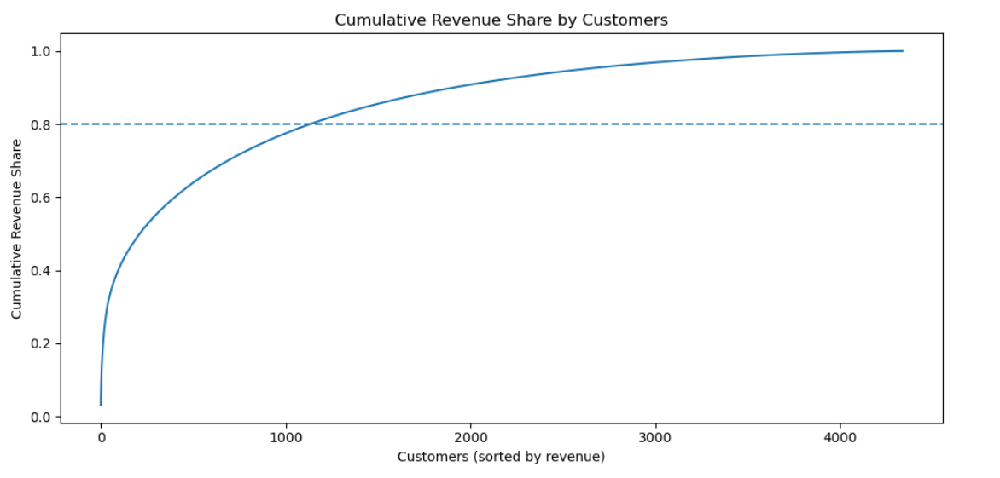
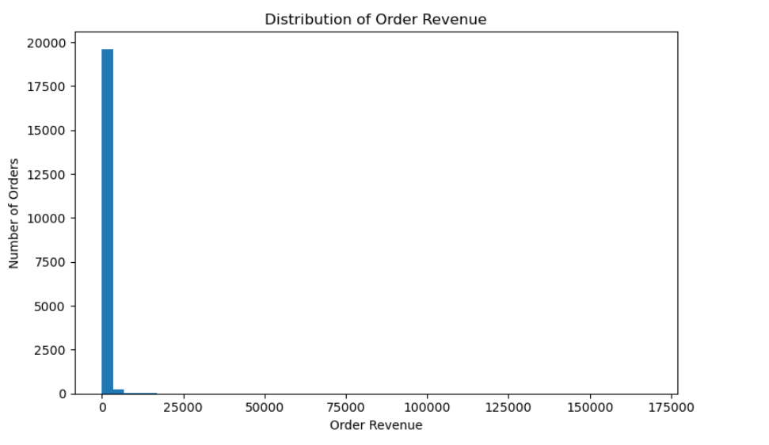

# Business Performance Analytics

## Project Overview
This project focuses on analyzing transactional data from an online retail company to assess business performance, customer concentration, and revenue dynamics over time.

The objective of the project is to demonstrate an end-to-end analytics workflow:  
from raw transactional data → data cleaning → KPI calculation → business insights → interactive dashboards.

## Data Source

The clean dataset is not included in the repository due to file size limitations.
the clean and raw datasets are available here:
https://drive.google.com/drive/folders/1-OxCxu3kUkfWN-SOgmVQpraj2LWJzxjQ?usp=drive_link

Place the file into `data/raw/` before running the notebook.

Source:
- Online Retail Dataset (UCI Machine Learning Repository)
  https://archive.ics.uci.edu/ml/datasets/online+retail

## Dataset
- **Source:** Online Retail transactional dataset  
- **Time period:** December 2010 – December 2011  
- **Size:** ~540,000 transaction rows  
- **Granularity:** Line-item transactional data  

Due to file size limitations, raw and processed datasets are not stored in this repository.  
All analysis steps are fully reproducible using the provided notebook.

## Tools & Technologies
- **Python:** pandas, matplotlib  
- **SQL:** SQLite (KPI validation and aggregations)  
- **Power BI:** interactive dashboards, DAX measures, slicers  
- **GitHub:** project structuring and version control  

## Analysis Scope
The analysis covers:
- Data quality checks (cancellations, zero or negative values, missing customer IDs)
- Transaction- and order-level aggregation
- Revenue-based KPIs and business metrics
- Customer concentration and Pareto (80/20) analysis
- Time-based revenue trends (monthly and yearly)
- Cross-validation of results using SQL queries

## Key Metrics
- **Total Revenue**
- **Total Orders**
- **Total Customers**
- **Average Order Value (AOV)**
- **Revenue per Customer**
- **Orders per Customer**

## Key Insights
- Revenue is highly concentrated across the customer base: a small fraction of customers generates the majority of total revenue, exposing the business to customer concentration risk.

- Order value distribution is strongly right-skewed, indicating that revenue growth is driven more by high-value transactions than by volume alone.

- Monthly revenue dynamics reveal clear seasonality with pronounced peaks toward the end of the year, suggesting demand is influenced by calendar-driven factors such as holidays and promotional periods.

- A significant share of customers contributes marginally to total revenue, highlighting opportunities for targeted retention strategies and differentiated customer segmentation.

- Revenue volatility over time emphasizes the importance of trend-aware and season-aware planning rather than relying on static averages.

## Power BI Dashboard
An interactive Power BI dashboard was developed to visualize key business insights, including:
- Total revenue by country
- Revenue trends over time
- Top customers by revenue
- Cumulative revenue share (Pareto curve)
- KPI summary cards with interactive filters (country, year, quarter)

The interactive Power BI dashboard is available in this repository:

`/powerbi/business_dashboard.pbix`

Due to GitHub limitations, the file cannot be previewed online.
To view the dashboard, please download the `.pbix` file and open it in Power BI Desktop.

### Dashboard Preview

### Customer Revenue Concentration (Pareto Analysis)

This chart illustrates cumulative revenue contribution by customers sorted by revenue.  
Approximately 80% of total revenue is generated by a relatively small subset of customers, highlighting strong revenue concentration.

### Distribution of Order Revenue

The revenue distribution is heavily right-skewed, indicating that most orders are low-value while a small number of transactions contribute disproportionately to total revenue.

### Monthly Revenue Over Time

Monthly revenue trends reveal clear seasonality, with noticeable growth toward the end of the year.  
This pattern aligns with typical retail demand cycles and supports season-aware business planning.

 ## The notebook includes:
- Data cleaning logic
- Feature engineering
- KPI computation
- Exploratory analysis
- SQL-based validation of metrics

## Business Interpretation

- The strong revenue concentration suggests that losing a small group of high-value customers could result in a disproportionate revenue decline. This highlights the need for focused retention, loyalty programs, and proactive account management for top customers.

- The heavy right-skew in order value indicates that upselling and cross-selling strategies may have a higher impact on revenue growth than efforts aimed solely at increasing transaction volume.

- Clear seasonal revenue patterns imply that inventory planning, marketing budgets, and operational capacity should be adjusted ahead of peak demand periods to avoid missed revenue opportunities or supply constraints.

- Customers with low individual contribution but high frequency represent a potential growth segment if nudged toward higher-value purchases through personalized offers or bundles.

- Observed revenue volatility reinforces the importance of forward-looking forecasting and scenario planning rather than backward-looking KPI monitoring alone.

## Author
**Konstantin Rudnev**  
Aspiring Data Analyst / Business Analyst  
Open to opportunities across Europe

GitHub: https://github.com/Konstantin667

## License
This project is licensed under the MIT License.
